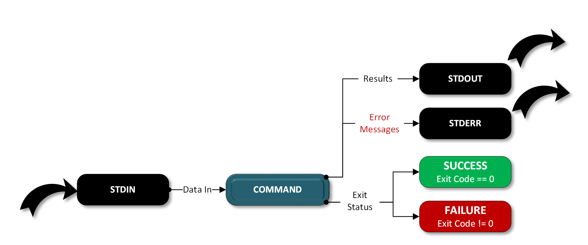
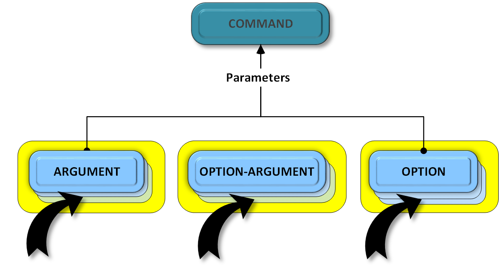
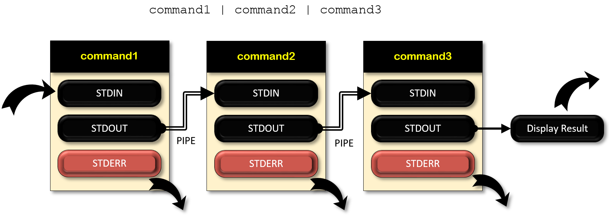

##################################################
Structures: Command-Line Utility Design Structures
##################################################

=======================
Definition of a Command
=======================

Simply put a ``command`` is a list of ``strings`` or ``words`` interpreted
as a ``command-name`` followed by a list of ``arguments``.  [Free08]_

========================================
Command-Line Utility Compositional Model
========================================

The traditional command-line utility compositional mode has
the following characteristics ... [Micr17]_

Commands Receive Bytes from STDIN and Emit Bytes to STDOUT & STDERR
-------------------------------------------------------------------

.. topic:: Commands are `standalone processes` that:

  * Accept a sequence of text parameters
    (*that might have been typed on a command line*.)
  * Accept data from ``STDIN``.
  * Write results to ``STDOUT``.  
  * Write error messages to ``STDERR``.
  * Return an ``exit status``, sometimes referred to as a ``return status``
    or ``exit code``.

.. topic:: A well-behaved POSIX command-line utiltiy should: [Coop14]_

  * Return an exit status of ``0`` upon **successful** completion.
  * Return an exit status of ``Non-Zero`` value if **unsuccessful**.

Standard Streams 
^^^^^^^^^^^^^^^^

  [Bear15]_

  Standard Input or Stdin
    Accepts stuff.

  Standard Output or Stdout
    Spits stuff out.

  Standard Error or Stderr
    Spits out error messages (usually defaults to the terminal.)

  Pipes
    Moves stuff between streams.

Commands Have Arguments & Options
---------------------------------

Command-line utilities accept parameters which can be categorized as:

  1. ``Options (Flags)``
  2. ``Option-Arguments``
  3. ``Arguments``

**Options (flags)**   

  An option, also sometimes referred to as a switch or a flag, is a
  single-letter code, or sometimes a single word or set of words, that
  modifies the behavior of a command in some predetermined way. Options only
  have two states; if the option is specified the flag is set to a defined
  value, if not it's set to its default value.

**Option-Arguments**

  An ``Option`` immediately followed by one or more required ``Arguments``.

**Arguments**

  An ``argument``, also called a ``command-line argument``, is a file name
  or other data that is provided to a command in order for the command to
  use it as an input. [Free16]_

  Arguments are also referred to as ``positional arguments`` since the order
  in which they are specified matters.

.. csv-table:: Argument & Option Terminology Mapping
  :header: Parser Term, POSIX Term, Description

  Command, Utility, A command-line utility.
  Argument, Operand, A positional argument; order matters.
  Option, Option-Argument, An option that expects an argument. 
  Option (Flag), Option, A optional switch that defines behavior.

.. Warning::

  Parser & POSIX terminology is often used interchangably.

.. topic:: POSIX Utility Conventions: [Open16]_

  .. code::

      utility_name [-a][-b][-c option_argument]
      [-d|-e][-f[option_argument]][operand...]

  * The ``utility`` in the above example is named `utility_name`.

  * It is followed by ``options``, ``option-arguments``, and ``operands``.

  * The   arguments that consist of `dash-characters` and `single-letters`
    or `digits`, such as ``a``, are known as ``options`` (or, historically,
    ``flags``).

  * Certain ``options`` are followed by an ``option-argument``, as shown with
    ``[ -c option_argument]``.

  * The arguments following the last ``options`` and ``option-arguments`` are
    named ``operands``.

.. Tip::

    Confused?  Don't worry, you don't need to know how all this works yet,
    this guide will gently guide you through the process.

GNU Project Standards
---------------------

The options described up to now were single-character options also known as
``short-options``.  ``Long- options`` were introduced by the GNU project.
All options should be assigned at least one long-option name to make your
commands more user friendly, short option names are not always necessary.

One of the advantages of long-named options is that they can be consistent
from program to program. For example, users should be able to expect the
`verbose` option of any GNU program which has one, to be spelled precisely
``--verbose``. To achieve this uniformity, look at the `table of common long-
option names`_ when you choose the option names for your program." [Free16]_

* All ``long-options`` should be prefixed with two dashes (``-``).
* All long ``Option-Arguments`` should contain an equal-sign (``=``) between
  the option and the argument. 

All programs should support two standard options::

  1. ``--help``
  2. ``--version``

Although it's not in the standards and not universally implemented for every
command-line utility, the folowing pattern is very common and I'd recommend
including the short-options:

  * ``-h`` for ``--help``
  * ``-V`` for ``--version``

An upper-case ``V`` is used for version to avoid confusion since the lower-
case ``v`` which is usually used as a short-option for ``--verbose``.

=======================
Commands Are Composable
=======================

Chaining
--------

Composition is achieved by picking out the important elements of one
command’s output and providing them as parameters or data to another
command.

An important consideration when designing command-line utilties is the
format of the output. It should be in a format that can be read, decoded and
parsed by the next command. Sometimes this means providing users options to
generate different output formats to support different `use cases`_.

.. hint:: 

    For an introduction to pipelines, redirection, and other such
    incantations see `An Illustrated Guide to Shell Magic`_.

    For Microsoft specific information visit the
    `Windows Redirection Reference`_.

    For those who are interested in a slightly more advanced reference see
    `Linux I/O Redirection`_.  Windows 10 users can follow along using the
    `Windows Subsystem for Linux`_.  This is not required to build POSIX
    command-line utilities, but it's helpful to see the different ways your
    program may be used, and it demonstrates the purpose of adhering to
    common command-line utility structure guidelines.

Grouping & Nesting
------------------

Comands can be nested, for example ``pip install`` is actually two separate
commands that have been grouped together to form a multi-command.

  * ``pip`` is a command that contains a command, sometimes referred to as
    a ``subcommand``. In this case ``pip`` contains the subcommand named
    ``install``;  ``pip`` also has options.
  
  * ``install`` is a separate command that has its own arguments and options.
    It is a ``child`` command whose ``parent`` is ``pip``.  Child commands
    can inherit arguments and options from the parent.

.. rubric:: Nested Commands::

  pip [options] install [options] arguments ...

.. note::

  Notice how each command has it's own options.

.. rubric:: A command can contain many subcommands, for example:

.. code-block:: none

  pip --help

  Usage:
    pip <command> [options]

  Commands:
    install                     Install packages.
    download                    Download packages.
    uninstall                   Uninstall packages.
    freeze                      Output installed packages in requirements format.
    list                        List installed packages.
    show                        Show information about installed packages.
    check                       Verify installed packages have compatible dependencies.
    search                      Search PyPI for packages.
    wheel                       Build wheels from your requirements.
    hash                        Compute hashes of package archives.
    completion                  A helper command used for command completion.
    help                        Show help for commands.

**********
References
**********

.. target-notes::

.. _An Illustrated Guide to Shell Magic:
    https://learn.adafruit.com/basic-shell-magic/standard-io-and-pipes

.. _Windows Redirection Reference:
    https://ss64.com/nt/syntax-redirection.html

.. _Linux I/O Redirection:
    http://www.w3resource.com/linux-system-administration/i-o-redirection.php

.. _Windows Subsystem for Linux:
    https://msdn.microsoft.com/en-us/commandline/wsl/about

.. _Use Cases:
    http://www.digitizationguidelines.gov/term.php?term=usecase

.. _Table of Long Option Names:
