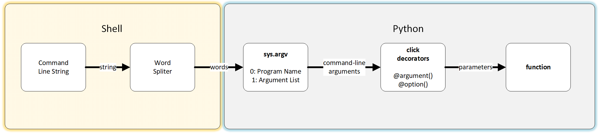

###########################################################
Wordsplitting: How Your Shell Splits Command-Line Arguments
###########################################################

The user's ``shell`` splits the command-line string into ``words`` before
passing them as ``command-line arguments`` to Python, which assigns
them to ``sys.argv``.

1. ``sys.argv[0]`` contains the `program name`
2. ``sys.arg[1:]`` contains the list of ``command-line arguments``

.. note::
    
    The interpretation of command-line arguments, including `word-splitting`
    is dependent on the shell; not every shell parses the command-line 
    string the same way. Generically speaking however, it splits words
    at whitespaces and trims any left over whitespace from the ends.

.. topic:: Info on how shells/consoles parse command-line arguments:

    * `CMD (Microsoft Command Console)`_
    * `Bash (Bourne Again Shell)`_
    * `Tcsh/Csh (C Shell)`_
    * `Ksh (Korn Shell)`_
    * `Zsh (Z Shell)`_
    * `Fish (Friendly Interactive Shell)`_

If it's not in the list you'll need to manually search for documentation
specific to your shell.

===========================
Quoting & Escape Characters
===========================

.. rubric:: Quoting can be used to:

* Disable special treatment for special characters.
* To prevent reserved words from being recognized as such.
* To prevent parameter expansion.
* To protect multi-word arguments from word spliting.

.. rubric:: Escape characters can be used to:

* Disable special treatment for a single special character.

.. rubric:: Bash provides two types of quoting:

1. `Weak quoting`: ``double-quotes``
2. `Strong quoting`: ``single-quotes``

.. rubric::  Windows only allows double-quotes

You don't necessarily need to understand the details of each shell, but if
you support command-utilities and a it's helpful to know how the shells
parse the command string before it ever gets to your Python program.

**********
Learn More
**********

.. topic:: For more information you can visit the following links::

* `Bash Quotes & Escaping Reference`_
* `Microsoft CMD Quotes & Escaping Reference`_
* `Microsoft CMD Escape Characters, Delimiters and Quotes`_

**********
References
**********

.. target-notes::

.. _`Bash (Bourne Again Shell)`:
    http://mywiki.wooledge.org/Arguments_

.. _`CMD (Microsoft Command Console)`:
    https://docs.microsoft.com/en-us/cpp/c-language
    parsing-c-command-line-arguments

.. _`Tcsh/Csh (C Shell)`:
    http://www.tcsh.org/tcsh.html/Lexical_structure.html

.. _`Ksh (Korn Shell)`:
    https://www.dartmouth.edu/~rc/classes/ksh/arguments.html#top

.. _`Zsh (Z Shell)`:
    https://linux.die.net/man/1/zshexpn

.. _`Fish (Friendly Interactive Shell)`:
    https://fishshell.com/docs/current/

.. _`Microsoft CMD Argument Syntax Reference`:
    https://ss64.com/nt/syntax-args.html

.. _`Bash Quotes & Escaping Reference`:
    http://wiki.bash-hackers.org/syntax/quoting

.. _`Microsoft CMD Quotes & Escaping Reference`:
    https://ss64.com/bash/syntax-quoting.html

.. _`Microsoft CMD Escape Characters, Delimiters and Quotes`:
    https://ss64.com/nt/syntax-esc.html
